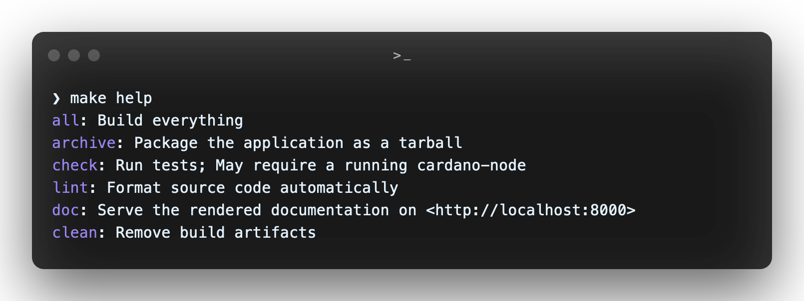

# Contributing

## What can you contribute?

#### 1. Feedback

Contributions in the form of feedback and issue is very much welcome. Might it be a suggestion, a bug report or maybe some questions that you have. It helps improving Kupo in the long run and these are probably the best kind of contributions to start with.

Do not hesitate to add _thumbs up :+1:_ to open issues to show your interest.

#### 2. Donation

Feel like tossing some coins for the project? Become a [sponsor](https://github.com/sponsors/KtorZ) !


#### 3. Code

Make sure to first read the [user-manual 📖](https://cardanosolutions.github.io/kupo) if you're willing to hack a bit on Kupo. Then, `make help` should provide a good starting point.



For development, [cabal](https://cabal.readthedocs.io/en/latest/) should work _out-of-the-box_<sup>TM</sup> provided
that you have the right system dependencies. That is, you'd need the following:

- `libsodium-dev 1.0.*`
- `libgmp-dev 6.1.*`
- `libssl-dev 1.1.*`
- `libpcre3-dev 2.8.*`
- `libsystemd-dev`
- `zlib1g-dev 1.2.*`
- [bitcoin-core/secp256k1@ac83be33](https://github.com/bitcoin-core/secp256k1/tree/ac83be33d0956faf6b7f61a60ab524ef7d6a473)

You can run tests using:

```console
$ make check

# or similarly

$ cabal test all
```

Some tests are end-to-end and require to have a running (and roughly synchronized) [cardano-node](https://github.com/input-output-hk/cardano-node/) and/or [ogmios](https://github.com/CardanoSolutions/ogmios/) against the testnet. These tests are automatically skipped, unless you set the following environment variables (using [`direnv`](https://direnv.net/docs/installation.html) for that is pretty convenient):

```bash
# For cardano-node
export CARDANO_NODE_SOCKET=/path/to/testnet/cardano-node/node.socket
export CARDANO_NODE_CONFIG=/path/to/testnet/cardano-node/config.json

# For Ogmios
export OGMIOS_HOST=127.0.0.1
export OGMIOS_PORT=1337
```

Coding standards are enforced using tools and configuration defined in the repository. Make sure to configure your editor to pick them up.

Pull requests are welcome, but we do recommend to open an issue to bring any idea to discussion first!

## About Issues / Discussion

### :bug: How To Report A Bug

Open a [Bug Ticket](https://github.com/cardanosolutions/kupo/issues/new?template=bug.md).

### :bulb: How To Propose An Idea

If you've already got a clear idea, open a [Proposal ticket](https://github.com/cardanosolutions/kupo/issues/new?template=idea.md). Otherwise, feel free to bring it as a [discussion [category: idea]](https://github.com/CardanoSolutions/kupo/discussions/new?category=ideas) first.

### :question: How To Ask a Question

Create a [Q&A Discussion](https://github.com/CardanoSolutions/kupo/discussions/new?category=q-a)

> Make sure to mark your question as _Answered_ once resolved!
