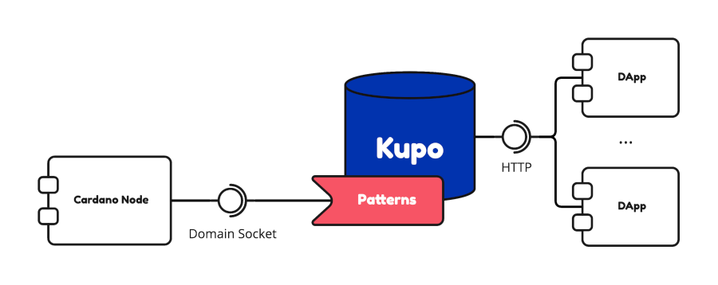

  

---

  <a href="https://cardanosolutions.github.io/kupo">📖 User Manual</a>
  |
  <a href="CONTRIBUTING.md">🤝 Contributing</a>
  |
  <a href="CHANGELOG.md"> 💾 Changelog</a>
  |
  <a href="https://twitter.com/_KtorZ_"> Twitter (@_KtorZ_)</a>

---

**Kupo** is fast, lightweight and configurable **chain-index** for the Cardano blockchain. It synchronizes data from the blockchain according to **patterns** matching addresses present in transaction outputs and builds a **lookup table** from matches to their associated **output references**, **values**, **datums** and **scripts**.

  <picture>
    <source media="(prefers-color-scheme: dark)" srcset="./docs/architecture-diagram-dark.png 300w" sizes="300px">
    <source media="(prefers-color-scheme: dark and min-width: 480px)" srcset="./docs/architecture-diagram-dark.png 450w" sizes="450px">
    <source media="(prefers-color-scheme: dark and min-width: 780px)" srcset="./docs/architecture-diagram-dark.png 600w" sizes="600px">
    <source media="(min-width: 480px)" srcset="./docs/architecture-diagram-light.png 450w" sizes="450px">
    <source media="(min-width: 780px)" srcset="./docs/architecture-diagram-light.png 600w" sizes="600px">
    
  </picture>

# Roadmap

### Cutting-edge work

The project keeps a [changelog 💾](./CHANGELOG.md) in which all _recent-but-not-yet-released_ changes can be seen. Changes in the changelog have been implemented and are available in latest builds from the `master` branch.

> **Warning** Work available on the `master` branch shall be considered _unstable_ in the sense that interfaces may slightly change and database migrations may not work from a previous `master` commit. Keeping stability between unreleased commits is only a best-effort.

### Planned work

The [projects boards 🎯][roadmap] list planned tasks that haven't been implemented but have reached enough maturity to be well-defined and scoped.

### Future work

Finally, [discussions 💡][discussions] contains ongoing discussions regarding the future of Kupo, with design decisions still under consideration.

# System Requirements

| Category         | Value            |
| ---              | ---              |
| Operating System | Linux / MacOS    |
| Architecture     | arm64 / amd64    |
| RAM              | 256MB-2048MB[^1] |
| CPU              | 2+ cores         |
| Disk Storage     | 1MB-40GB[^2]     |

# Continuous Integration

| Status | Description |
| --- | --- |
|  | Docker build, shipping images to [Dockerhub](https://hub.docker.com/r/cardanosolutions/kupo) |
|  | Nix build, providing static binary executables as artifacts. |
|  | [User manual][] and API reference deployment. |
|  | Test code coverage. Learn more about the [testing strategy][]. |

# Alternatives

Kupo is well-suited for small (or large) applications which need either:

- a global chain index for resolving outputs by address, policy id or output reference;
- a on-the-fly monitoring of an address, policy id or specific transaction output over a short period of time.

It runs in constant memory and is blazing fast. Yet, its use-cases are limited. Here below we provide some possible alternatives with different trade-offs:

  
Scrolls

Key differences(s): Scrolls provides (at this stage) an in-memory aggregation engine via Redis. It allows applications to watch and react instantly on the evolution of some aggregated metric (see Scrolls' README for details about what metrics are supported). Because the data is fully stored in-memory, it is not possible to index the entire chain without resorting to large memory requirements. Hence it is more tailored to specific handpicked pieces of information. It also synchronizes blocks from the chain using the node-to-node protocol which means that it can do so on any remote node relay, but it is also slower (because a more defensive protocol) than the node-to-client protocol upon which Kupo relies.

  <a href="https://github.com/txpipe/scrolls">Learn more</a>
  

  
Oura

Key difference(s): Oura in itself does not provide any chain-indexing, but it supports pluggable sinks where filtered data from the Cardano blockchain can be dumped into (e.g. Elastic Search or Kafka). It also supports a wider variety of events. All-in-all, a good fit for more elaborate solutions.

  <a href="https://github.com/txpipe/oura/#readme">Learn more</a>
  

  
Carp

Key difference(s): Carp is a modular blockchain indexer built on top of Oura; it synchronizes data in a PostgreSQL database based on behaviors described in _tasks_ (Rust standalone plugins). Some pre-defined common tasks are already available, other can be written on-demand to fit one's use case. As a primary interface, Carps fully relies on PostgreSQL.

  <a href="https://dcspark.github.io/carp/docs/intro/">Learn more</a>

  
cardano-db-sync

Key difference(s): cardano-db-sync synchronizes ALL data from the Cardano blockchain, whereas Kupo focuses only on transaction outputs. This comes with obvious trade-offs in both on-disk storage, runtime requirements and performances. Kupo is usually an order of magnitude faster for retrieving outputs by address, stake address or policy id. Note also that like Carp, cardano-db-sync's primary interface is a PostgreSQL database whereas Kupo offers a higher-level HTTP API over JSON.

  <a href="https://github.com/input-output-hk/cardano-db-sync#cardano-db-sync">Learn more</a>

  
Marconi

Key differences(s): In a similar fashion to Carp, Marconi offers a modular indexer infrastructure where users can customize data streams through standalone plugins (however written in Haskell). It synchronizes data across multiple streams (utxo, datums and scripts), filters them based on custom plugins and stores them in a SQLite database. At this stage, Marconi is also in at an early development phase.

  <a href="https://github.com/input-output-hk/plutus-apps/tree/main/marconi#marconi">Learn more</a>

## Sponsors

A big thank to [all our sponsors 💖](https://github.com/CardanoSolutions#-sponsors).

[testing strategy]: https://github.com/CardanoSolutions/kupo/tree/master/test#testing-strategy
[user manual]: https://cardanosolutions.github.io/kupo
[discussions]: https://github.com/CardanoSolutions/kupo/discussions/categories/ideas?discussions_q=category%3AIdeas+sort%3Atop
[roadmap]: https://github.com/CardanoSolutions/kupo/projects?type=classic

[^1]: The maximum memory usage depends on runtime flags and internal settings. This can be made lower if necessary (possibly as small as a hundred megabytes) by tweaking those settings. The obvious counter-part being slower synchronization times when syncing over large chunks of data. When synchronized, however, this has close to no impact.

[^2]: The size of the database depends on the patterns the indexer is configured with. Storing every single entry of Mainnet currently come close to ~40GB. However, if pruned (i.e. only keep unspent entries), Mainnet is around 4GB.
