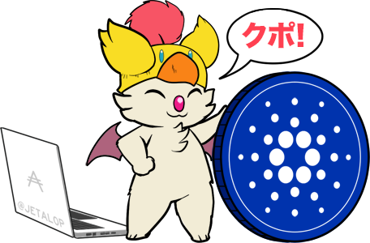

  

**Kupo** is fast, lightweight and configurable **chain-index** for the Cardano blockchain. It synchronizes data from the blockchain according to **patterns** matching addresses present in transaction outputs and builds a **lookup table** from matches to their associated **output references**, **values**, **datums** and **scripts**. 

  

# Getting Started

See the [user-manual 📖](https://cardanosolutions.github.io/kupo).

# Roadmap 

See [projects 🎯](https://github.com/CardanoSolutions/kupo/projects?type=classic).

# System Requirements

| Category         | Value                                     |
| ---              | ---                                       |
| Operating System | Linux 64-bit                              |
| RAM              | 1280MB1                        |
| CPU              | 2 cores                                   |
| Disk Storage     | Variable (few MB, up to 40GB)2 |

> <strong>1</strong> The maximum memory usage depends on runtime flags and internal settings. This can be made lower if necessary (possibly as small as a hundred megabytes) by tweaking those settings. The obvious counter-part being slower synchronization times when syncing over large chunks of data. When synchronized, however, this has close to no impact. 

> <strong>2</strong> The size of the database depends on the patterns the indexer is configured with. Storing every single entry of Mainnet currently come close to ~40GB. However, if pruned (i.e. only keep unspent entries), Mainnet is around 4GB.
> 

# Continuous Integration

| Status | Description | 
| --- | --- | 
|  | Docker build, shipping images to [Dockerhub](https://hub.docker.com/r/cardanosolutions/kupo) |
|  | Nix build, providing static binary executables as artifacts. | 
|  | [User manual][] and API reference deployment. |
|  | Test code coverage. Learn more about the [testing strategy][]. |

# Alternatives

Kupo is well-suited for small applications which need either: 

- a global chain index for resolving output references;
- a on-the-fly monitoring of an address over a short period of time.

It runs in constant memory and is blazing fast. Yet, its use-cases are limited. Here below we provide some possible alternatives with different trade-offs:

  
oura

Key difference(s): Oura in itself does not provide any chain-indexing, but it supports pluggable sinks where filtered data from the Cardano blockchain can be dumped into (e.g. Elastic Search or Kafka). It also supports a wider variety of events. All-in-all, a good fit for more elaborate solutions.

  <a href="https://github.com/txpipe/oura/#readme">Learn more</a>
  

  
scrolls

Key differences(s): Scrolls provides (at this stage) only an in-memory storage via Redis. This means that it's not possible to index the entire chain without resorting to large memory requirements. It also synchronizes blocks from the chain using the node-to-node protocol which means that it can do so on any remote node relay, but it is also slower (because a more defensive protocol) than the node-to-client protocol upon which Kupo relies. 

  <a href="https://github.com/txpipe/scrolls">Learn more</a>
  

  
cardano-db-sync

Key difference(s): cardano-db-sync synchronizes ALL data from the Cardano blockchain, whereas Kupo focuses only on transaction outputs. This comes with obvious trade-offs in both on-disk storage but also runtime requirements. 

  <a href="https://github.com/input-output-hk/cardano-db-sync#cardano-db-sync">Learn more</a>

  
plutus-chain-index

Key differences(s): the plutus-chain-index is the native component behind the PAB (Plutus Application Backend). It is however intended to be user-facing and as such, does not provide a friendly user experience for uses outside of the PAB's internals.

  <a href="https://github.com/input-output-hk/plutus-apps/tree/main/plutus-chain-index-core#plutus-chain-index">Learn more</a>

## Sponsors 💖 

  
  
  
  
  
  
  
  
  
  
  
  
  
  
  
  

---

  <a href="https://cardanosolutions.github.io/kupo">📖 User Manual</a>
  |
  <a href="CONTRIBUTING.md"> 📐 Contributing</a>
  |
  <a href="CHANGELOG.md"> 💾 Changelog</a>
  |
  <a href="https://twitter.com/_KtorZ_"> Twitter (@_KtorZ_)</a>

[testing strategy]: https://github.com/CardanoSolutions/kupo/tree/master/test#testing-strategy
[user manual]: https://cardanosolutions.github.io/kupo
