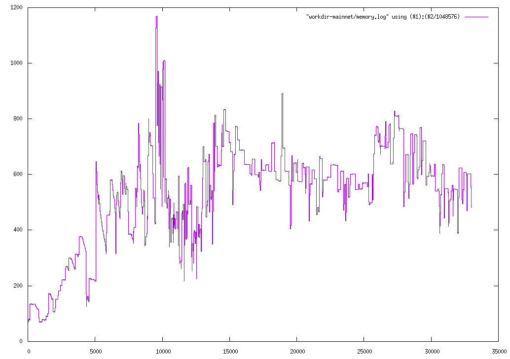
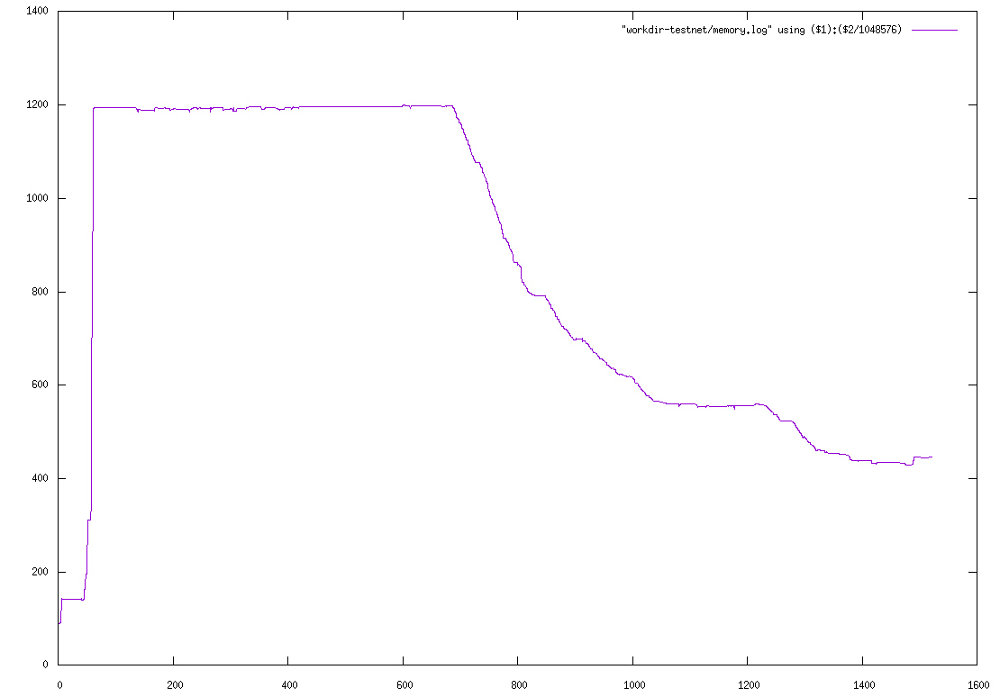

# Benchmarks

## Hardware Specifications

- AMD Ryzen 9 4900HS (4007MHz, 512KiB L1, 4MiB L2, 8MiB L3)
- 2 x 8GiB SODIMM DDR4 Synchronous Unbuffered 3200 MHz (0.3 ns)
- INTEL SSDPEKNW010T8 PCIe (1800 MB/s Write,  1800 MB/s Read) 

## Mainnet

### Synchronization

| version       | options        | duration             |
| ---           | ---            | ---                  |
| `v1.0.1`      | N/A            | ~10-14h<sup>\*</sup> |
| `v2.0.0-beta` | `--prune-utxo` | 16h 45min            |

> <sup>(\*)</sup>Exact time is unknown as it wasn't properly tracked at the time and was done through multiple runs. So this is therefore a gross bracket. 




<p align="right">
  See also <a href="./synchronize.js">synchronize.js</a>
</p>

### Query

#### `v2.0.0-beta`

Name         | Value
---          | ---
`fragment`   | `stake1uxqh9rn76n8nynsnyvf4ulndjv0srcc8jtvumut3989cqmgjt49h6`

```console
$ curl -s "http://$hostname/matches/$fragment" > /dev/null

real	0m2.557s
user	0m0.082s
sys	0m0.136s

128978 matches.
```

```console
$ curl -s "http://$hostname/matches/$fragment?unspent" > /dev/null

real	0m2.086s
user	0m0.038s
sys	0m0.163s

105425 matches.
```


Name         | Value
---          | ---
`fragment`   | `addr1zxj47sy4qxlktqzmkrw8dahe46gtv8seakrshsqz26qnvzypw288a4x0xf8pxgcntelxmyclq83s0ykeehchz2wtspksr3q9nx`
`policy_id`  | `d7726f6b882c6fc2ca0cd96c51e5328e1d577d789b085ee0fbe23bf7`
`asset_name` | `55676c7942726f546865446566696e697469766536393439`

```console
$ curl -s "http://$hostname/matches/$fragment" > /dev/null

real	0m2.659s
user	0m0.116s
sys	0m0.123s

128952 matches.
```

```console
$ curl -s "http://$hostname/matches/$fragment?unspent" > /dev/null

real	0m1.856s
user	0m0.127s
sys	0m0.070s

128952 matches.
```

```console
$ curl -s "http://$hostname/matches/$fragment?unspent&policy_id=$policy_id&asset_name=$asset_name" > /dev/null

real	0m0.601s
user	0m0.000s
sys	0m0.007s

1 match.
```

<p align="right">
  See also <a href="./jpeg-store-mainnet.sh">jpeg-store-mainnet.sh</a>
</p>

## Testnet

### Synchronization

| version       | options        | duration |
| ---           | ---            | ---      |
| `v1.0.1`      | N/A            | 55min    |
| `v2.0.0-beta` | `--prune-utxo` | 50min    |
| `v2.0.0-beta` | \-             | 65min    |



<p align="right">
  See also <a href="./synchronize.js">synchronize.js</a>
</p>

### Query

#### `v2.0.0-beta`

Name         | Value
---          | ---
`fragment`   | `addr_test1wrsexavz37208qda7mwwu4k7hcpg26cz0ce86f5e9kul3hqzlh22t`

```console
$ curl -s "http://$hostname/matches/$fragment" > /dev/null

real	0m1.611s
user	0m0.079s
sys	0m0.069s

125228 matches.
```

```console
$ curl -s "http://$hostname/matches/$fragment?unspent" > /dev/null

real	0m1.665s
user	0m0.059s
sys	0m0.090s

125228 matches.
```

```console
$ curl -s "http://$hostname/matches/$fragment?spent" > /dev/null

real	0m0.004s
user	0m0.000s
sys	0m0.003s

0 match.
```


Name         | Value
---          | ---
`fragment`   | `stake_test1uzdlw6rjechunh4u03p3eersp6sxpfdwlhkq59ea3mttgfsag8smr`

```console
$ curl -s "http://$hostname/matches/$fragment" > /dev/null

real	0m0.006s
user	0m0.000s
sys	0m0.004s

21 matches.
```

```console
$ curl -s "http://$hostname/matches/$fragment?unspent" > /dev/null

real	0m0.010s
user	0m0.004s
sys	0m0.004s

21 matches.
```

```console
$ curl -s "http://$hostname/matches/$fragment?spent" > /dev/null

real	0m0.008s
user	0m0.002s
sys	0m0.005s

0 match.
```


Name         | Value
---          | ---
`fragment`   | `6058ae2ba01b03504e0e2c418b44dd431dffe4105172332c518a94b3fe`

```console
$ curl -s "http://$hostname/matches/$fragment" > /dev/null

real	0m0.010s
user	0m0.007s
sys	0m0.000s

1 match.
```

```console
$ curl -s "http://$hostname/matches/$fragment?unspent" > /dev/null

real	0m0.006s
user	0m0.000s
sys	0m0.004s

1 match.
```

```console
$ curl -s "http://$hostname/matches/$fragment?spent" > /dev/null

real	0m0.008s
user	0m0.003s
sys	0m0.005s

0 match.
```
