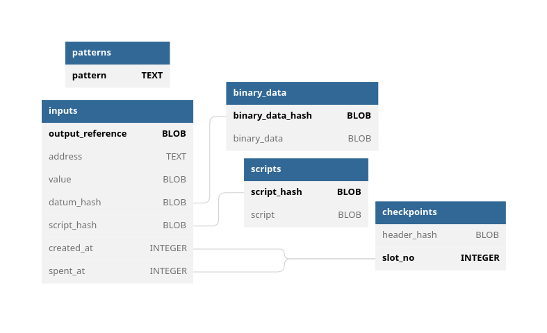

## Overview

<p align="center">
  <picture>
    <source media="(prefers-color-scheme: dark)" srcset="./schema-dark.png">
    
  </picture>
</p>

<details>
  <summary>See complete definition</summary>

```sql
CREATE TABLE `inputs` (
  `output_reference` BLOB PRIMARY KEY NOT NULL,
  `address` TEXT COLLATE NOCASE NOT NULL,
  `value` BLOB NOT NULL,
  `datum_hash` BLOB,
  `script_hash` BLOB,
  `created_at` INTEGER NOT NULL,
  `spent_at` INTEGER
);
CREATE INDEX `inputsByAddress`   ON `inputs` (`address` COLLATE NOCASE, `spent_at`);
CREATE INDEX `inputsByCreatedAt` ON `inputs` (`created_at`, substr(output_reference, -2));
CREATE INDEX `inputsByDatumHash` ON `inputs` (`datum_hash`);

CREATE TABLE `checkpoints` (
  `header_hash` BLOB NOT NULL,
  `slot_no` INTEGER PRIMARY KEY NOT NULL
);
CREATE INDEX `checkpointsBySlot` ON `checkpoints` (`slot_no`);

CREATE TABLE `binary_data` (
  `binary_data_hash` BLOB PRIMARY KEY NOT NULL,
  `binary_data` BLOB NOT NULL
);
CREATE INDEX `binaryDataByHash` ON `binary_data` (`binary_data_hash`);

CREATE TABLE `scripts` (
  `script_hash` BLOB PRIMARY KEY NOT NULL,
  `script` BLOB NOT NULL
);
CREATE INDEX `scriptByHash` ON `scripts` (`script_hash`);

CREATE TABLE `patterns` (
  `pattern` TEXT PRIMARY KEY NOT NULL
);
```
</details>

## Changelog

<p align="right"><code>v2.0.0-beta</code></p>
<hr/>

### Migration to `version=5`

- Add columns `inputs.spent_at`;
- Rename column `inputs.slot_no` into `inputs.created_at`;
- Remove column `inputs.header_hash` (now obtained via joining on the `checkpoints` table);
- Add compound index `inputsByAddress` for `inputs`;
- Add index `checkpointsBySlotNo` on `checkpoints`;
- New table `binary_data` indexing binary data by hashes;
- New table `scripts` indexing scripts (Plutus & native) by hashes;
- New columns `inputs.datum_hash` & `inputs.script_hash` with foreign references to `binary_data` and `scripts` respectively;
- Add index `inputsByDatumHash` on `inputs`;
- Mark `inputs.address` columns as `COLLATE NOCASE`;
- Addresses in `inputs.address` are stored differently (see [bf5e98a6](https://github.com/CardanoSolutions/kupo/commit/bf5e98a6a57eaacf21d3e0ab0fecbac5c5af8028)).


<p align="right"><code>v1.0.1</code></p>
<hr/>

### Migration to `version=4`

- Removes all matches of mainnet & testnet transactions that failed phase-2 validations and consumed collaterals.

<p align="right"><code>v1.0.0</code></p>
<hr/>

### Migration to `version=3`

- Add a new `patterns` table to support (a) persisting patterns configuration and (b) managing patterns dynamically via HTTP.

### Migration to `version=2`

- Add a new `header_hash` column to the inputs table (to associate matches with fully qualified points made of slot and block header hash).
