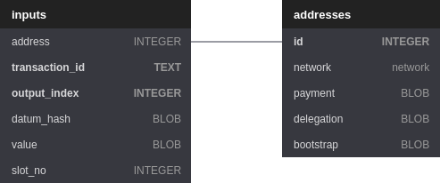

## Current Overview

<p align="center"></p>

<details>
  <summary>See complete definition</summary>

```sql
Table inputs {
  output_reference BLOB [pk, not null]
  address TEXT [not null]
  value BLOB [not null]
  datum_hash BLOB 
  created_at INTEGER [not null]
  spent_at INTEGER
  Indexes {
    (address, spent_at) [name: 'inputsByAddress']
  }
}

Table checkpoints {
  header_hash BLOB [not null]
  slot_no INTEGER [pk, not null]

  Indexes {
    (slot_no) [name: 'checkpointsBySlot']
  }
}

Table patterns {
  pattern TEXT [pk, not null]
}
```
</details>

## Changelog

### Migration to `version=6`

- Set `synchronous = normal` 

### Migration to `version=5`

- Add columns `spent_at`;
- Rename column `slot_no` into `created_at`;
- Remove column `header_hash` (now obtain via joining on the `checkpoints` table);
- Add compound index (address, spent_at) for `inputs`;
- Add index on `slot_no` for `checkpoints`.
-
### Migration to `version=4`

- Removes all matches of mainnet & testnet transactions that failed phase-2 validations and consumed collaterals. 

### Migration to `version=3`

- Add a new `patterns` table to support (a) persisting patterns configuration and (b) managing patterns dynamically via HTTP.

### Migration to `version=2`

- Add a new `header_hash` column to the inputs table (to associate matches with fully qualified points made of slot and block header hash). 
