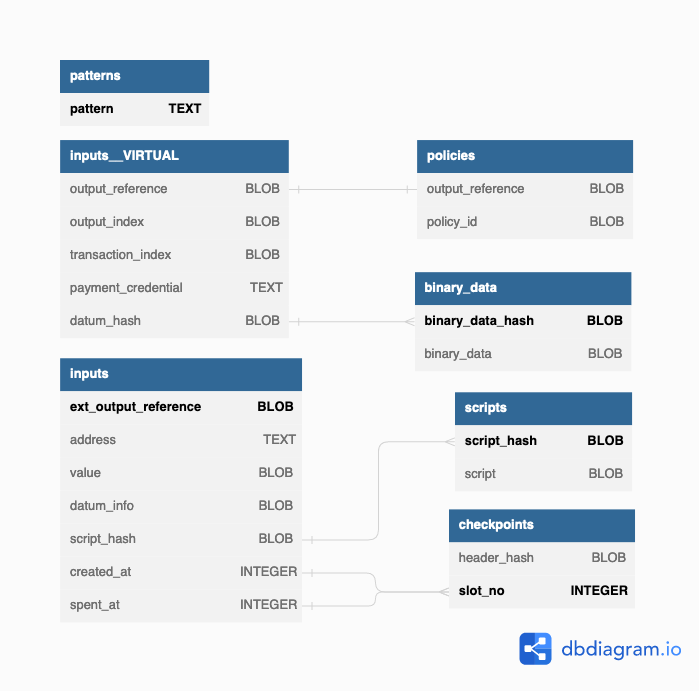

## Overview

<p align="center">
  <picture>
    <source media="(prefers-color-scheme: dark)" srcset="./schema-dark.png">
    
  </picture>
</p>

<details>
  <summary>See complete definition</summary>

```sql
CREATE TABLE `inputs` (
  `ext_output_reference` BLOB NOT NULL,
  `address` TEXT COLLATE NOCASE NOT NULL,
  `value` BLOB NOT NULL,
  `datum_info` BLOB,
  `script_hash` BLOB,
  `created_at` INTEGER NOT NULL,
  `spent_at` INTEGER,
  `spent_by` BLOB,
  `spent_with` BLOB,

  `output_reference` BLOB NOT NULL GENERATED ALWAYS AS (substr(`ext_output_reference`, 1, 34)) VIRTUAL,
  `output_index` BLOB NOT NULL GENERATED ALWAYS AS (substr(`ext_output_reference`, -4, 2)) VIRTUAL,
  `transaction_index` BLOB NOT NULL GENERATED ALWAYS AS (substr(`ext_output_reference`, -2)) VIRTUAL,
  `datum_hash` BLOB GENERATED ALWAYS AS (substr(`datum_info`, 2)) VIRTUAL,
  `payment_credential` TEXT COLLATE NOCASE NOT NULL GENERATED ALWAYS AS (substr(`address`, -56)) VIRTUAL,

  PRIMARY KEY (`ext_output_reference`)
);

CREATE UNIQUE INDEX `inputsByOutputReference` ON `inputs` (`output_reference`);

CREATE INDEX `inputsByAddress` ON `inputs` (`address` COLLATE NOCASE);
CREATE INDEX `inputsByPaymentCredential` ON `inputs` (`payment_credential` COLLATE NOCASE);
CREATE INDEX `inputsByCreatedAt` ON `inputs` (`created_at`);
CREATE INDEX `inputsBySpentAt` ON `inputs` (`spent_at`);

CREATE TABLE `policies` (
  `output_reference` BLOB NOT NULL,
  `policy_id` BLOB NOT NULL,
  PRIMARY KEY (`output_reference`, `policy_id`),
  CONSTRAINT `fk_policies_inputs`
    FOREIGN KEY (`output_reference`)
    REFERENCES inputs(`output_reference`)
    ON DELETE CASCADE
);

CREATE TABLE `checkpoints` (
  `header_hash` BLOB NOT NULL,
  `slot_no` INTEGER PRIMARY KEY NOT NULL
);

CREATE TABLE `binary_data` (
  `binary_data_hash` BLOB PRIMARY KEY NOT NULL,
  `binary_data` BLOB NOT NULL
);

CREATE TABLE `scripts` (
  `script_hash` BLOB PRIMARY KEY NOT NULL,
  `script` BLOB NOT NULL
);

CREATE TABLE `patterns` (
  `pattern` TEXT PRIMARY KEY NOT NULL
);
```
</details>

## Changelog

<p align="right"><code>v2.10.0</code></p>
<hr/>

### Migration to `version=10`

- Add `spent_by` and `spent_with` columns to `inputs` to track redeemers and transaction spending a particular UTxO.

<p align="right"><code>v2.5.0</code></p>
<hr/>

- Remove `spent_at` from compound indexes `inputsByAddress` and `inputsByPaymentCredential`
- Add permanent index `inputsBySpentAt(spent_at)`

<p align="right"><code>v2.2.0</code></p>
<hr/>

### Migration to `version=9`

- Rename column `datum_hash` to `datum_info`
- Add a virtual column `datum_hash` to inputs, as a substring of `datum_info` (with the same semantic as before)
- Delete all inputs with datums, and rollback checkpoints to before the first block with a datum

<p align="right"><code>v2.1.0</code></p>
<hr/>

### Migration to `version=8`

- Rename column `output_reference` into `ext_output_reference`
- Add a virtual column `output_reference` to inputs, and add a unique index to index
- Add a virtual column `transaction_index` to inputs, capturing the transaction index of an `ext_output_reference`
- Add a virtual column `output_index` to inputs, capturing the output index of an `ext_output_reference`
- Create a new table `policies` with a foreign key on `inputs.output_reference`
- Also remove all indexes from previous migrations, indexes are now created by the application logic and can be deferred to after full sync.

### Migration to `version=7`

- Add a virtual column `payment_credential` to `inputs` and a corresponding index on that column.

### Migration to `version=6`

- Rework the format of `output_reference` to also now be serialized with the transaction index of the corresponding output.

<p align="right"><code>v2.0.0-beta</code></p>
<hr/>

### Migration to `version=5`

- Add columns `inputs.spent_at`;
- Rename column `inputs.slot_no` into `inputs.created_at`;
- Remove column `inputs.header_hash` (now obtained via joining on the `checkpoints` table);
- Add compound index `inputsByAddress` for `inputs`;
- Add index `checkpointsBySlotNo` on `checkpoints`;
- New table `binary_data` indexing binary data by hashes;
- New table `scripts` indexing scripts (Plutus & native) by hashes;
- New columns `inputs.datum_hash` & `inputs.script_hash` with foreign references to `binary_data` and `scripts` respectively;
- Add index `inputsByDatumHash` on `inputs`;
- Mark `inputs.address` columns as `COLLATE NOCASE`;
- Addresses in `inputs.address` are stored differently (see [bf5e98a6](https://github.com/CardanoSolutions/kupo/commit/bf5e98a6a57eaacf21d3e0ab0fecbac5c5af8028)).


<p align="right"><code>v1.0.1</code></p>
<hr/>

### Migration to `version=4`

- Removes all matches of mainnet & testnet transactions that failed phase-2 validations and consumed collaterals.

<p align="right"><code>v1.0.0</code></p>
<hr/>

### Migration to `version=3`

- Add a new `patterns` table to support (a) persisting patterns configuration and (b) managing patterns dynamically via HTTP.

### Migration to `version=2`

- Add a new `header_hash` column to the inputs table (to associate matches with fully qualified points made of slot and block header hash).
